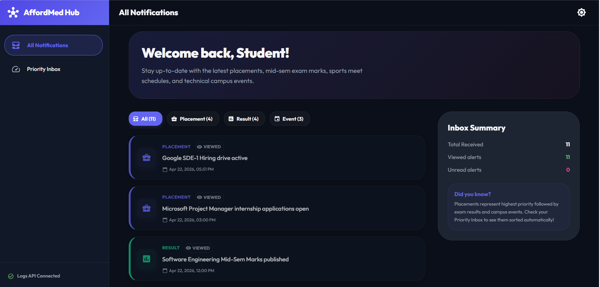
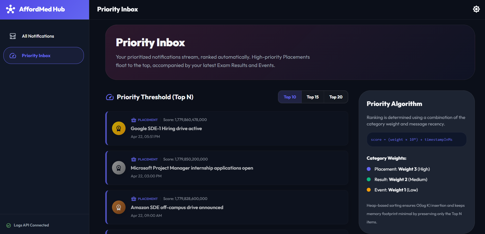
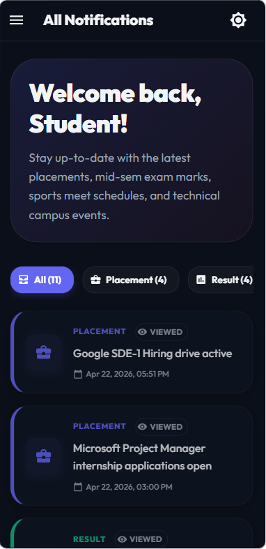
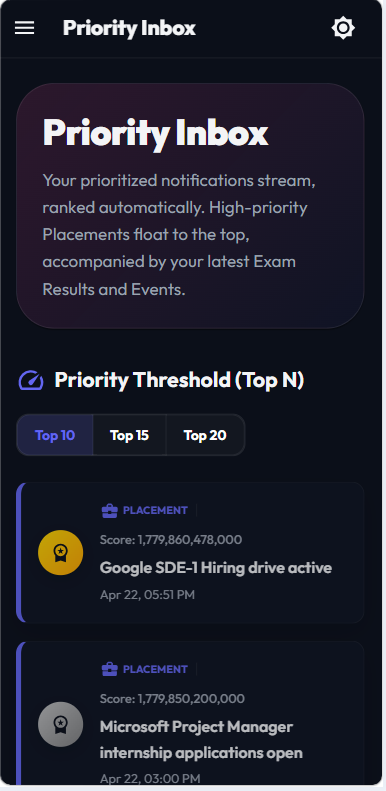

# Campus Notifications Platform

A complete production-ready microservice platform designed for campus notification delivery and analysis, built for the AffordMed Campus Hiring Assessment.

---

## 1. Project Overview
This repository provides:
- **Logging Middleware:** Reusable logging engine targeting the AffordMed Logs API.
- **Stage 1 Backend:** A Node.js cli application with complete authentication, token managers, and O(N log K) priority-scoring list aggregation.
- **Stage 2 Frontend:** Next.js 15 App Router web application incorporating Material UI layout elements, client-side priority ranking with MinHeap, dynamic list filters, client-side pagination, and unviewed/viewed cache syncing via `localStorage`.

---

## 2. Architecture Diagram (ASCII)

```
                       +-----------------------------------+
                       |       Stage 2 Next.js FE          |
                       |  (Filters, Viewed Badges, Heap)   |
                       +-----------------+-----------------+
                                         |
                                         | (Rest Fetch calls)
                                         v
+------------------------+     +---------------------------+     +-------------------------+
|   Logging Middleware   |<----+     Stage 1 Node BE       |---->|   AffordMed APIs Host   |
| (Structured Retrying)  |     |  (CLI Sorting, Token Mg)  |     | (Auth, Register, Notif) |
+-------------------+----+     +-------------+-------------+     +-------------------------+
                    |                        |
                    |                        | (Forward Telemetry Logs)
                    v                        v
            +--------------------------------------------------+
            |               AffordMed Logs API                 |
            +--------------------------------------------------+
```

---

## 3. Folder Structure

```
2300321530212/
├── logging_middleware/
│   ├── logger.js               # Core log sender & retry mechanics
│   ├── constants.js            # Logging levels, stacks, packages validation
│   ├── logger.test.js          # Assert-based testing script
│   └── README.md               # Logger integration instructions
│
├── notification_app_be/
│   ├── auth/
│   │   ├── register.js         # Register credentials script
│   │   ├── authenticate.js     # Generate auth token script
│   │   └── tokenManager.js     # Validates/refreshes Bearer tokens
│   ├── config/
│   │   └── env.js              # Environment variable loader
│   ├── services/
│   │   └── notificationService.js  # Fetches and ranks notifications
│   ├── utils/
│   │   ├── priority.js         # Priority score calculator
│   │   └── MinHeap.js          # Custom O(log K) heap prioritizer
│   ├── apiClient.js            # Axios client with auto-refresh intercepts
│   ├── priorityNotifications.js # Main CLI runner (Top 10 display)
│   ├── test_priority.js        # Priority/Heap sorting verification
│   ├── package.json            # BE package definition
│   └── .env.example            # Backend env variable template
│
├── notification_app_fe/
│   ├── src/
│   │   ├── app/
│   │   │   ├── layout.tsx      # Next.js global shell
│   │   │   ├── page.tsx        # Dashboard Route (/ list & filters)
│   │   │   └── priority/
│   │   │       └── page.tsx    # Priority Inbox Route (/priority)
│   │   ├── components/
│   │   │   ├── Layout.tsx      # Drawer/AppBar navigation layout
│   │   │   ├── ViewedBadge.tsx # Unread/Read status indicator
│   │   │   ├── NotificationCard.tsx # Beautiful alert display card
│   │   │   ├── NotificationList.tsx # Layout grid and state handler
│   │   │   ├── FilterBar.tsx   # Chips categorization selection
│   │   │   └── PriorityInbox.tsx # Heap ranking card stack
│   │   ├── hooks/
│   │   │   └── useNotifications.ts # LocalStorage cache & state hook
│   │   ├── services/
│   │   │   └── api.ts          # Axios wrapper and logFrontend
│   │   ├── theme/
│   │   │   └── theme.ts        # Dark/Light mode theme configurations
│   │   ├── types/
│   │   │   └── notification.ts # TS definitions
│   │   └── utils/
│   │       └── priority.ts     # Frontend scoring & TS MinHeap
│   ├── package.json            # FE package definition
│   ├── tsconfig.json           # TS configurations
│   ├── next.config.mjs         # Next.js configuration properties
│   └── .env.example            # Frontend env variable template
│
├── notification_system_design.md # Algorithmic design documentation
├── README.md                   # Project instructions
└── .gitignore                  # Git tracking exclusions
```

---

## 4. Authentication Setup

### Step 1: Register
1. Populate your `ACCESS_CODE` in `notification_app_be/.env` (derived from `2300321530212/notification_app_be/.env.example`).
2. Run the register command:
   ```bash
   npm run register
   ```
3. This creates your `clientID` and `clientSecret`.

### Step 2: Set credentials
Copy the returned credentials and populate them inside `CLIENT_ID` and `CLIENT_SECRET` in your `notification_app_be/.env` file.

### Step 3: Auth Token
Run `npm run auth` or launch the script directly. It fetches a token and outputs it. Paste it under `ACCESS_TOKEN` in `notification_app_be/.env`.

---

## 5. Environment Variables

### Backend `.env`
```ini
CLIENT_ID=your_client_id
CLIENT_SECRET=your_client_secret
ACCESS_TOKEN=your_token
API_BASE_URL=http://4.224.186.213
LOGS_API_URL=http://4.224.186.213/evaluation-service/logs
```

### Frontend `.env`
```ini
NEXT_PUBLIC_API_BASE_URL=http://4.224.186.213
NEXT_PUBLIC_LOGS_API_URL=http://4.224.186.213/evaluation-service/logs
NEXT_PUBLIC_ACCESS_TOKEN=your_token
```

---

## 6. Running Stage 1 (Backend CLI)
To install dependencies and output the prioritized list:
```bash
cd notification_app_be
# Install dependencies
npm install
# Run CLI
npm start
```

Example CLI Output:
```
TOP 10 PRIORITY NOTIFICATIONS
1. Placement - Google Hiring SWE
2. Placement - Amazon Hiring SDE
3. Result - End-Sem Results
4. Event - Cultural Night
...
```

---

## 7. Running Stage 2 (Frontend Server)
To run the Next.js portal:
```bash
cd notification_app_fe
# Install dependencies
npm install
# Start dev server
npm run dev
```
Open [http://localhost:3000](http://localhost:3000) to view the portal.

---

## Screenshots

### Desktop - All Notifications


### Desktop - Priority Inbox


### Mobile - All Notifications


### Mobile - Priority Inbox


## 8. Complexity Analysis & Scalability Discussion
- **Time Complexity:**
  - Parsing & Scoring: $O(1)$
  - Bounded MinHeap Insertion: $O(\log K)$ per item
  - Total process: $O(N \log K)$ (effectively $O(N)$ for $K=10$)
- **Space Complexity:** Bounded to $O(K)$ space to retain only the top 10 elements in memory.
- **Scalability:** By avoiding loading all logs into a single memory buffer, the heap model scales perfectly to infinite streams. In enterprise deployment, Kafka consumers process scores and partition streams, while Redis Sorted Sets handle slice pagination.
