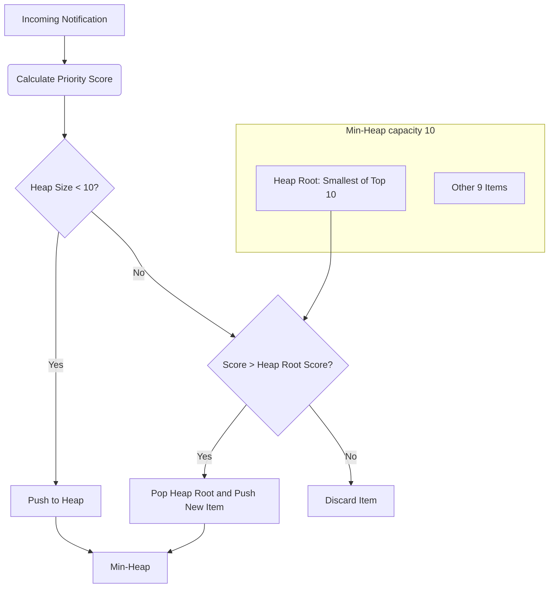

# Stage 1: Campus Notifications Microservice System Design

This document details the system design, algorithmic decisions, complexity analysis, and architectural scalability of the Campus Notifications Platform.

---

## 1. Problem Statement
A campus notifications platform receives many real-time notifications from different academic packages (Placements, Results, and Events). Students face information overload. The system needs to prioritize these notifications so students see critical information (e.g. placements and immediate results) before less urgent events.
The backend must fetch notifications from a protected endpoint, calculate scores, maintain the top 10 highest-ranked items, and transmit telemetry logs to a central Logs API. The frontend must reproduce this logic and present it in a responsive interface.

---

## 2. Notification Structure
The external AffordMed API serves notifications matching the following schema:

```json
{
  "notifications": [
    {
      "ID": "placement_9921a",
      "Type": "Placement",
      "Message": "Google SDE hiring applications open",
      "Timestamp": "2026-04-22 17:51:18"
    }
  ]
}
```

- **ID:** String. Unique identifier.
- **Type:** String. Categorized as `Placement`, `Result`, or `Event`.
- **Message:** String. Description of the notification.
- **Timestamp:** String. Formatted as `YYYY-MM-DD HH:mm:ss`.

---

## 3. Priority Formula
Priority is defined as a function of its **Category Weight** and **Recency**:

$$\text{priorityScore} = (\text{weight} \times 10^9) + \text{timestampInMilliseconds}$$

### Category Weights
- **Placement:** Weight = 3
- **Result:** Weight = 2
- **Event:** Weight = 1
- **Others (Default):** Weight = 0

### Impact of Constants
The multiplier $10^9$ (1 billion) corresponds to $1,000,000$ seconds, or approximately **11.57 days**.
- If a Placement alert (weight 3) is compared to a Result alert (weight 2), the Placement wins unless it is more than **11.57 days older** than the Result alert.
- This ensures a strong preference for placement updates while preventing extremely stale alerts from dominating fresh exam results indefinitely.

---

## 4. Ranking Strategy
To rank notifications, we compute the score for every item. Because the ranking order is descending (highest score first), we seek the $K$ largest elements. 
A naive approach would sort all $N$ notifications in $O(N \log N)$ time and take the first 10. However, when notifications arrive as a continuous stream or the size of $N$ is massive, loading and sorting all items in memory is highly inefficient.

---

## 5. Heap-Based Optimization
To maintain the Top $K$ elements ($K = 10$) efficiently, we implement a **Min-Heap** of fixed capacity $K$.



### Mechanism
1. Maintain a Min-Heap of capacity $K$.
2. For each incoming notification:
   - If the heap has fewer than $K$ elements, insert the notification.
   - If the heap has $K$ elements, compare the new notification's score with the score of the root element (the minimum of the current top $K$).
   - If the new notification's score is larger than the root's score, pop the root and push the new notification.
   - Otherwise, discard the notification.
3. The root of the heap is always the $K$-th largest element. This allows us to make comparisons in $O(1)$ time and heap modifications in $O(\log K)$ time.

---

## 6. Continuous Stream Handling
In a production streaming pipeline (e.g., using WebSockets, Server-Sent Events, or message brokers like Kafka):
- The Min-Heap resides in memory or a fast data cache (like Redis).
- As new items push into the system, they are evaluated against the heap boundary on the fly.
- Stale items are discarded immediately, ensuring memory footprint is strictly bounded to $O(K)$, regardless of whether we process 1,000 or 1,000,000,000 items.

---

## 7. Time Complexity
- **Priority Calculation:** $O(1)$ per notification (extracting type weight and parsing datetime string).
- **Min-Heap Bounded Insertion:**
  - $O(1)$ comparison against root score.
  - $O(\log K)$ binary-tree adjustments during bubble-down or bubble-up operations.
- **Overall Stream Processing:**
  - Processing $N$ items requires $O(N \log K)$ time.
  - For $K = 10$, $\log K \approx 3.32$, making this operations profile nearly linear: $O(N)$.
- **Final Sorting:**
  - Emptying the heap to construct the ranked output array takes $O(K \log K)$ operations.

---

## 8. Space Complexity
- **Heap Space:** Bounded strictly to $O(K)$ space to hold $K$ references.
- **Auxiliary Space:** $O(1)$ since swaps and comparisons are executed in-place.
- This is highly scalable compared to full list sorting, which demands $O(N)$ memory buffer.

---

## 9. Scalability Discussion
For enterprise scale (millions of users, thousands of updates per second):
1. **Caching Layer:** Place a Redis sorted set (ZSET) in front of database operations. The priority score acts as the set score, letting Redis handle top-N slicing natively.
2. **Distributed Heap:** When heap boundaries grow, we partition logs by student filters (e.g., branch or graduation year) to parallelize heap structures across independent nodes.
3. **Database Offloading:** Since the heap filters out bottom-tier events, we avoid write operations on persistent DB logs for discarded notifications.

---

## 10. Production Improvements
1. **Index Optimization:** Database level indexes on `Type` and `Timestamp` columns to support rapid retrieval.
2. **Message Broker Integration:** Using RabbitMQ or Kafka to feed stream handlers asynchronously.
3. **Microservice Isolation:** Moving the prioritizer into an independent Node worker queue separate from the API server.
